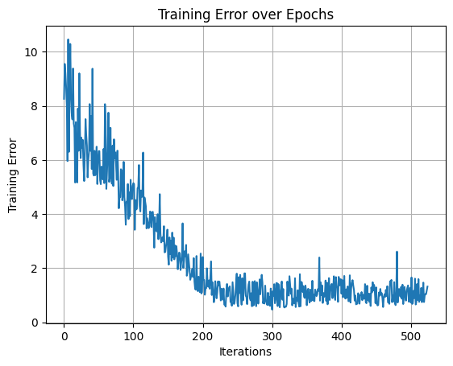

# 🪻 Rede de Camada Única


<div align="center">



</div>

> O projeto atual visa treinar uma rede neural de camada única para classificar a flor Íris entre versicolor, setosa e virgínica.

## 💻 Pré-requisitos

Antes de começar, verifique se você atendeu aos seguintes requisitos:

- Google Colab ou Jupyter Notebook

## 🚀 Instalando

Para instalar, siga estas etapas:

Crie um clone do repositório

```
git clone https://github.com/Seiixas/rna-iris.git
```

Faça o upload do arquivo `network.ipynb` no Google Colab ou Jupyter Notebook.

Leia as instruções markdown e execute as células Python presentes no notebook.
